# Event RSVP

Create, manage, and RSVP for events

## 📑 Table of Contents

- [Overview](#overview)
  - [Demo Link](#demo-link)
  - [Screenshots](#screenshots)
  - [Features](#features)
  - [Run Locally](#run-locally)
- [My Process](#my-process)
  - [Architecture Overview](#architecture-overview)
  - [Built With](#built-with)
  - [What I Learned](#what-i-learned)
  - [Continued Development](#continued-development)
  - [Useful Resources](#useful-resources)

## Overview

A full-stack event management and RSVP system that allows users to create & manage events, generate unique invite links, and collect/update RSVPs without requiring attendees to create an account.

Built with a focus on real-world product flows, authentication, security, and scalable backend design.

### Demo Link

- Live Demo: [https://yestogo.netlify.app/](https://yestogo.netlify.app/)

### Screenshots

<p align='center'>
  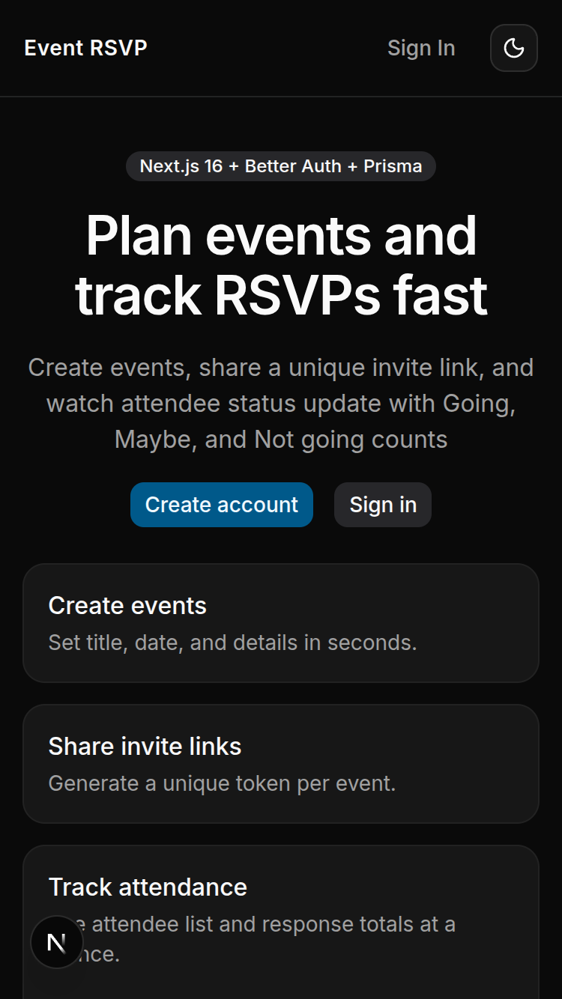
</p>

<p align="center">
  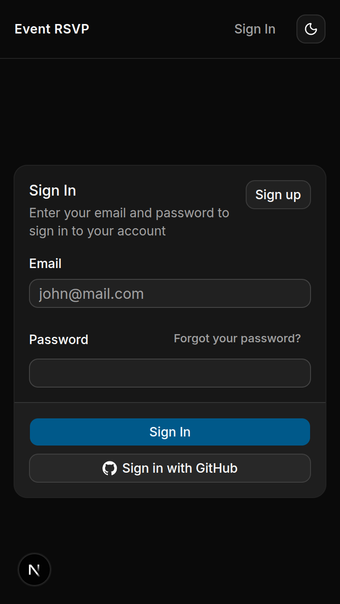
  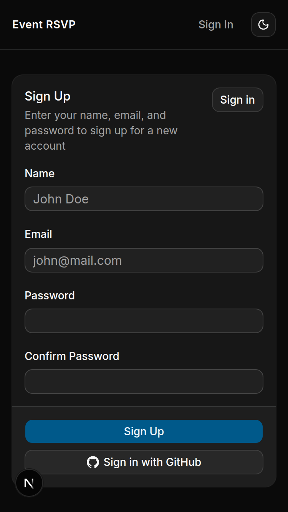
  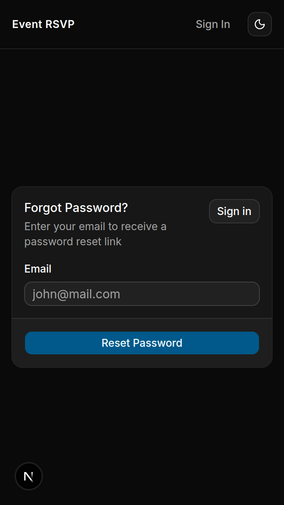
</p>

<p align="center">
  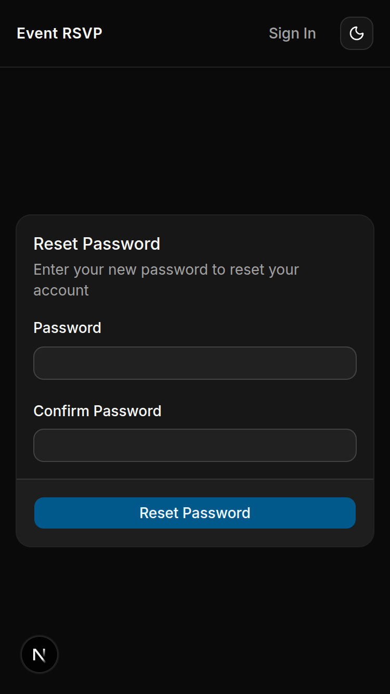
  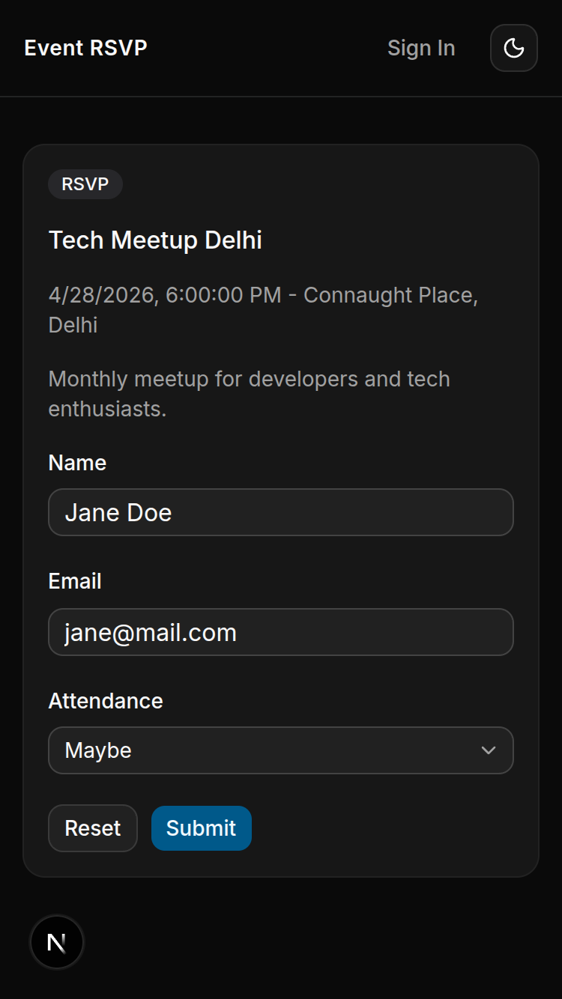
  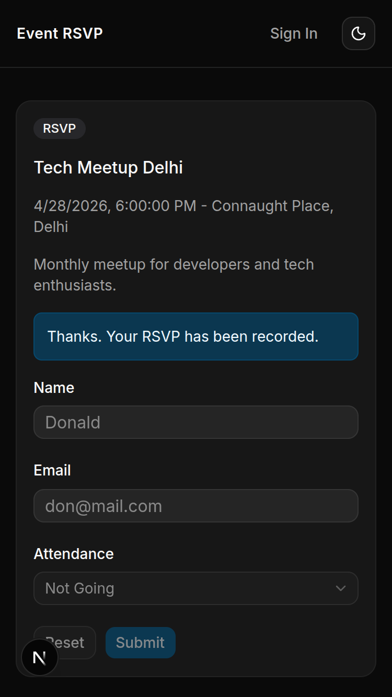
</p>

<p align='center'>
  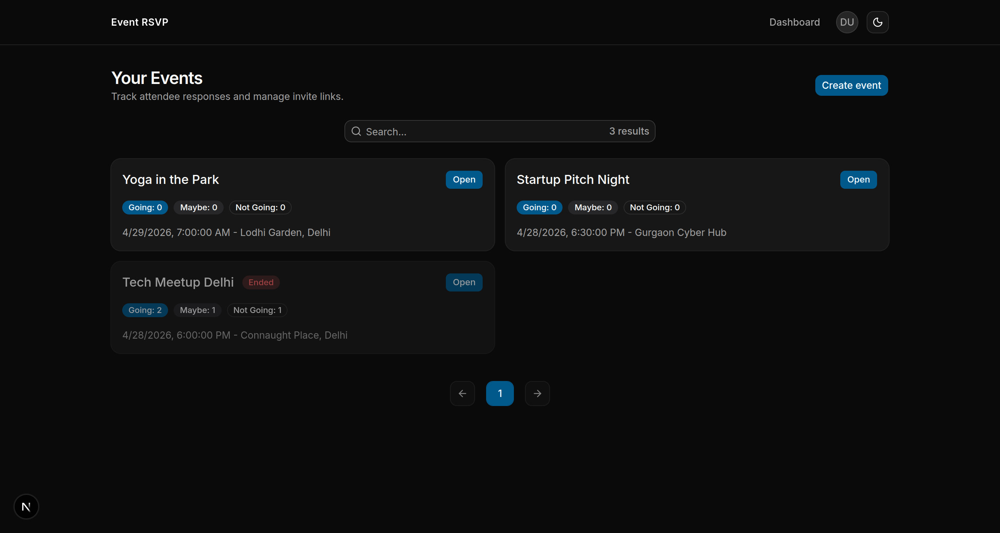
</p>

<p align="center">
  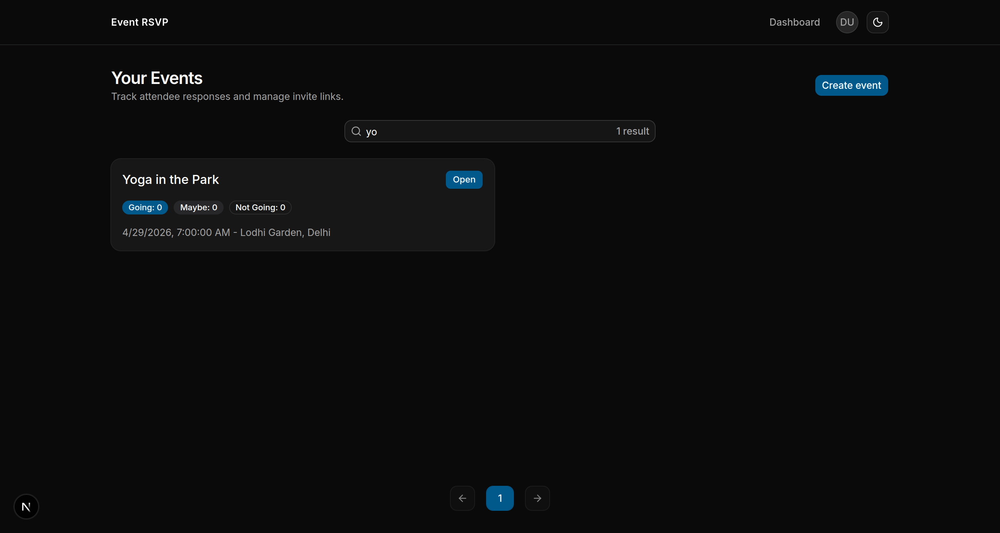
  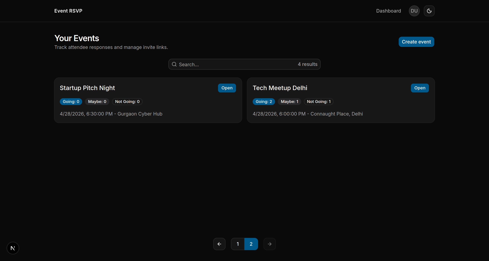
</p>

<p align="center">
  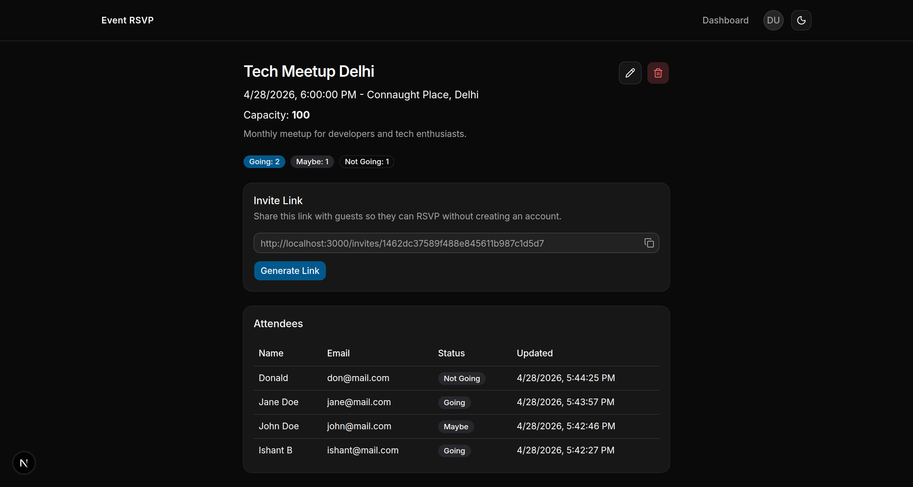
  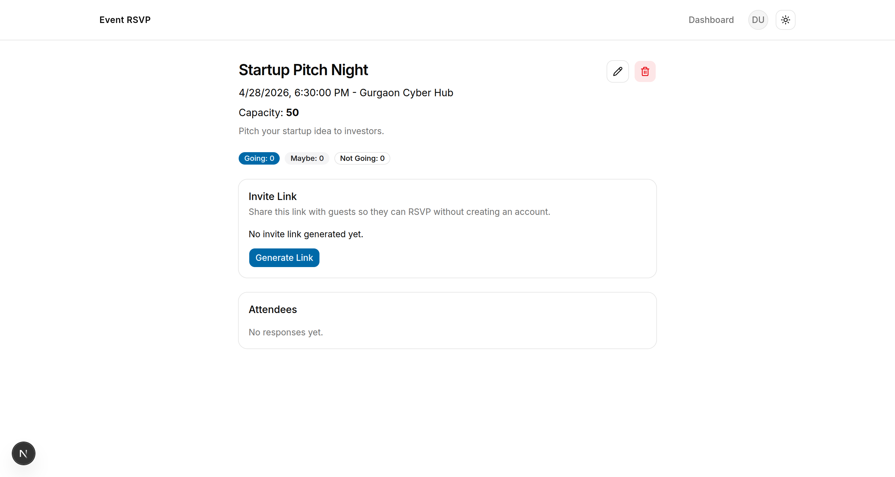
</p>

<p align="center">
  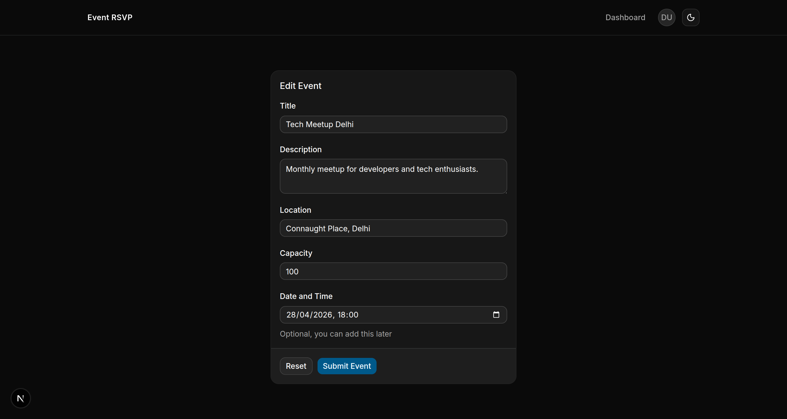
  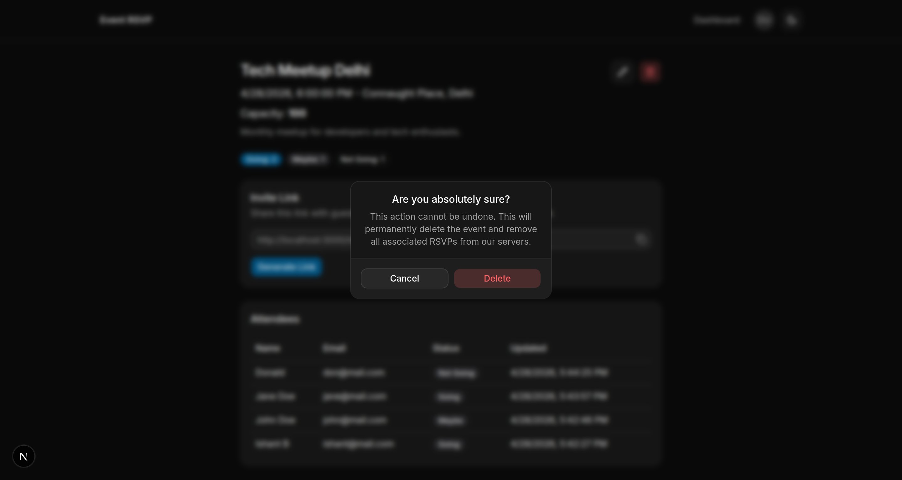
</p>

### Features

#### Authentication

- Email/password authentication
- GitHub OAuth login
- Secure password reset via email link
- Protected routes for authenticated users

#### Event Management

- Create, and update events
- Delete events with confirmation dialog
- Event fields:
  - Title
  - Description
  - Date & time
  - Location
  - Capacity
- Automatic event expiration handling (inactive after event date)
- Capacity enforcement (no RSVPs beyond limit)

#### RSVP System (Public + Secure)

- Public RSVP via unique invite links (no account required)
- RSVP fields:
  - Name
  - Email (normalized)
  - Status (Going / Not Going / Maybe)
- Users can update RSVP using same email

#### Dashboard

- User-specific event dashboard
- Paginated event listing
- Debounced search functionality
- Event detail view with RSVP analytics

#### Security & Performance

- Rate limiting using Redis:
  - RSVP submissions
  - Password reset requests
  - Login
- Middleware-based route protection:
  - Authenticated routes protected
  - Auth pages blocked for logged-in users
- Public RSVP routes protected via IP + event-level rate limiting

#### UX Enhancements

- Loading states for async operations
- Error handling with toast notifications
- Responsive UI

### Run Locally

#### Clone the repository

```bash
git clone https://github.com/ishantbh/event-rsvp.git

cd event-rsvp
```

#### Install dependencies

```bash
pnpm install
```

#### Add env variables

```
NEXT_PUBLIC_APP_URL=http://localhost:3000

# Pooled connection for application
DATABASE_URL=

# Direct connection for prisma cli
DIRECT_URL=

UPSTASH_REDIS_REST_URL=
UPSTASH_REDIS_REST_TOKEN=

BETTER_AUTH_SECRET=
BETTER_AUTH_URL=http://localhost:3000

GITHUB_CLIENT_ID=
GITHUB_CLIENT_SECRET=

RESEND_API_KEY=
```

#### Sync database

```bash
pnpm dlx prisma db push
```

#### Generate artifacts (if not already generated by postinstall script)

```bash
pnpm dlx prisma generate
```

#### Run the app

```bash
pnpm dev
```

## My Process

### Architecture Overview

- Server-first architecture using Next.js App Router
- Events CRUD
- Secure authentication flow with strict middleware enforcement
- Normalized RSVP system for consistent user tracking and deduplication
- Rate-limited public endpoints to prevent abuse
- Separation of public RSVP flow and authenticated dashboard system
- Login with email + password, and GitHub OAuth
- Secure password reset flow using email link
- Automatic event expiration post event date-time
- Debounced searching for events
- Paginated event listings
- Blocking RSVP submissions after event date-time (handled on frontend as well as backend)
- Simple honeypot protection from bots for RSVP form

### Built With

#### Frontend

- [Next.js](https://nextjs.org/)
- [React](https://react.dev/)
- [Tailwind CSS](https://tailwindcss.com/)
- [shadcn/ui](https://ui.shadcn.com/)
- [TanStack Form](https://tanstack.com/form/latest)
- [Sonner](https://sonner.emilkowal.ski/) (toasts)

#### Backend

- [Next.js Server Actions](https://nextjs.org/docs/app/getting-started/mutating-data)
- [Next.js API Routes](https://nextjs.org/docs/app/getting-started/route-handlers)
- [Prisma ORM](https://www.prisma.io/docs)
- PostgreSQL
- Redis (rate limiting)

#### Auth & Email

- [Better Auth](https://better-auth.com/docs/introduction)
- [GitHub](https://github.com/) OAuth
- [Resend](https://resend.com/) (email service)

#### Validation

- [Zod](https://zod.dev/)

### What I Learned

- Designing real-world authentication flows (including OAuth + password reset)
- Implementing rate limiting using Redis for sensitive endpoints
- Structuring multi-role access systems (public vs authenticated users)
- Handling event-based constraints like capacity and expiration
- Building scalable server actions in Next.js with interactive Prisma transactions and batch queries

### Continued Development

- Email notifications for RSVP updates
- Calendar integration
- Advanced analytics for event creators
- QR-based event check-ins
- Better invite tracking system
- Organizations/teams for collaboration
- Role-based access control (admin, creator, editor, user)

### Useful Resources

- [Build forms in React using TanStack Form and Zod](https://ui.shadcn.com/docs/forms/tanstack-form)
- [Set up rate limiting in Next.js with Redis](https://blog.logrocket.com/set-up-rate-limiting-next-js-redis/#creating-rate-limiting-method)
- [Prisma Transactions and batch queries](https://www.prisma.io/docs/orm/prisma-client/queries/transactions)
- [Events Manager with Next.js and Prisma](https://youtu.be/gh2L-nNXDsY)
- [Better-Auth + GitHub OAuth](https://better-auth.com/docs/authentication/github)
- [Send emails with Next.js](https://resend.com/docs/send-with-nextjs)
- [Connect from Prisma to Neon](https://neon.com/docs/guides/prisma)
- [Upstash Redis in Next](https://upstash.com/docs/redis/quickstarts/nextjs-app-router)
